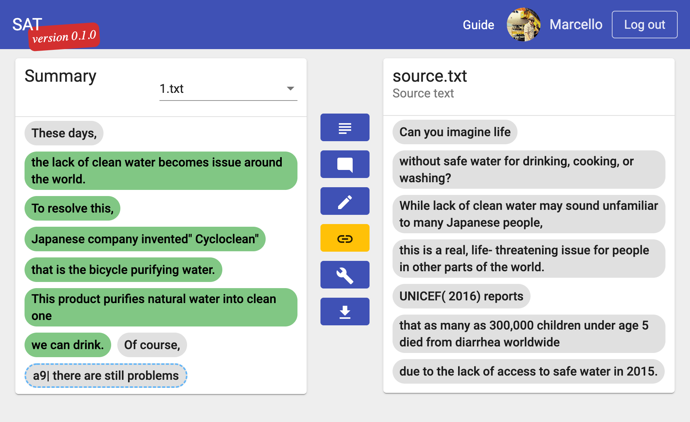

# Segmentation and Alignment Tool - SAT

Complete server architecture for a framework for supporting the annotation of Idea Unit alignment data.

Current server structure:
 - traefik: reverse proxy and TLS certificates handler
 - front-end: Angular front-end
 - computation: Python3 FastAPI server

The stack relies on Docker architecture and runs on docker-compose.

## First setup
Clone the repo and run `docker-compose build`.
Once build is complete you can run `docker-compose up` to bring the servers up.
Traefik handles reverse proxying.
The angular `front-end` is served on `localhost:5000`, the FastAPI `computation` server is accessible via `localhost:5000/api` and the traefik dashboard is accessible via `traefik.localhost:5000`.
The same URI schema is followed in production, except for the traefik dashboard, which is disabled.

Follow the instructions in [Deployement](##Deployement) when deploying the project to a production server.

## Deployement
When cloning the repo to a deployement server you will have to set up some .env files.
First copy `./.env.example` to `./.env` and populate DOMAIN_NAME and CERT_EMAIL.
These will be used to serve your server and request https certificates.

You also need to copy `./front-end/.env.example` to `./frontend/.env` and populate GOOGLE_OAUTH_SECRET. This is required to enable authentication.

Once the .env files are created, you can build the server from root by running `./prod-compose.sh build` and serve the stack via `./prod-compose.sh up -d`.
`./prod-compose.sh` is a simple shell script that aliases docker-compose to avoid specifying the production configuration file each time we call the server.
