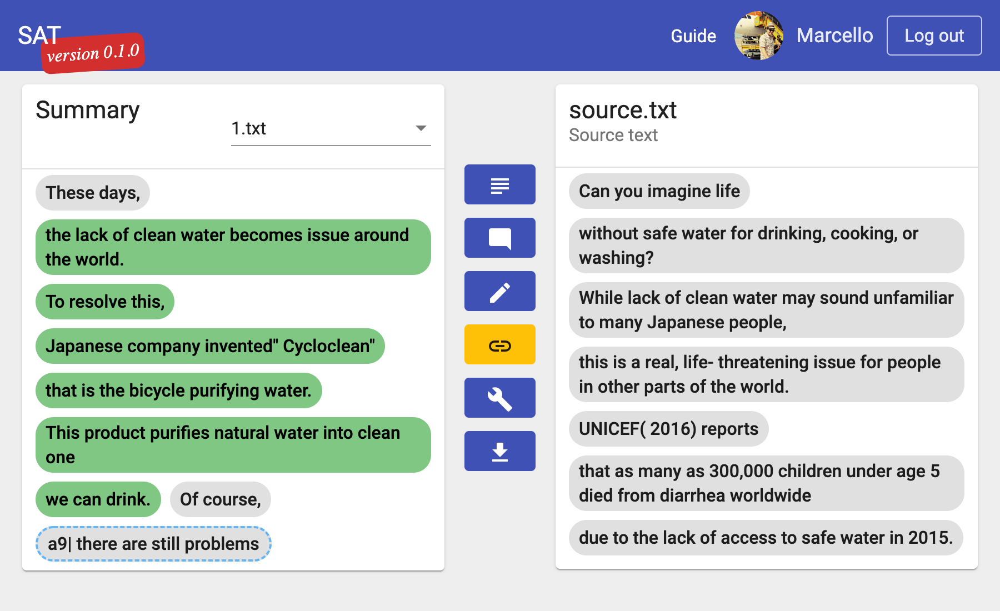

# SAT: Segmentation and Alignment Tool

Complete server architecture for a framework for supporting the annotation of Idea Unit alignment data.

Stack architecture:
 - traefik: reverse proxy and TLS certificates handler
 - computation: Python3 FastAPI server in charge of
    - OAuth authentication
    - GloVe wordvec hosting and cosine similarity operations
    - middleware for database interaction
 - front-end: Angular front-end
 - db: MongoDB instance

The stack relies on Docker and is designed to run either locally or on a single VPS via `docker compose`.

## First setup
Clone the repo and run `./setup_repo.sh`.
This will create the empty directories to be mounted as volumes and copy the `.env.example` files to `.env`.

**WARNING:** ensure to populate up environment files before your first compose run or you will have problems with mongo not initializing the users correctly

### Required environment files
#### MongoDB database
The `.env` files for Mongo setup are split in two to avoid passing the root user's credential to the FastAPI instance.
- `db/root_user.env`
- `db/api_user.env`

#### FastAPI instance
- `computation/fastapi.env`

#### Angular frontend
Angular doesn't rely on `.env` files, instead you will have to populate an `environment.ts` file.
- `front-end/src/environments/environment.ts`

#### HTTPS Certificate variables (Production only)
When cloning the repo to a deployement server, you will have to set up a domain name and an email for certbot. Editing this env file is not required when running the project locally.
- `./.env`

### Building and serving the project
Run `docker-compose build`.
Once build is complete you can run `docker-compose up` to bring the servers up.
Traefik handles reverse proxying.
The angular `front-end` is served on `localhost:5000`, the FastAPI `computation` server is accessible via `localhost:5000/api` and the traefik dashboard is accessible via `traefik.localhost:5000`.
The same URI schema is followed in production, except for the traefik dashboard, which is disabled.

Follow the instructions in [Deployement](##Deployement) when deploying the project to a production server.

## Deployement
Copy the repo to the production server and ensure that all `.env` files are populated correctly, including the [HTTPS Certificate Variables](#https-certificate-variables-production-only).

Once the `.env` files are populated, you can build the server from root by running `./prod-compose.sh build` and serve the stack via `./prod-compose.sh up -d`.
`./prod-compose.sh` is a simple shell script that aliases `docker compose` to avoid specifying the production configuration file each time we call the server.
